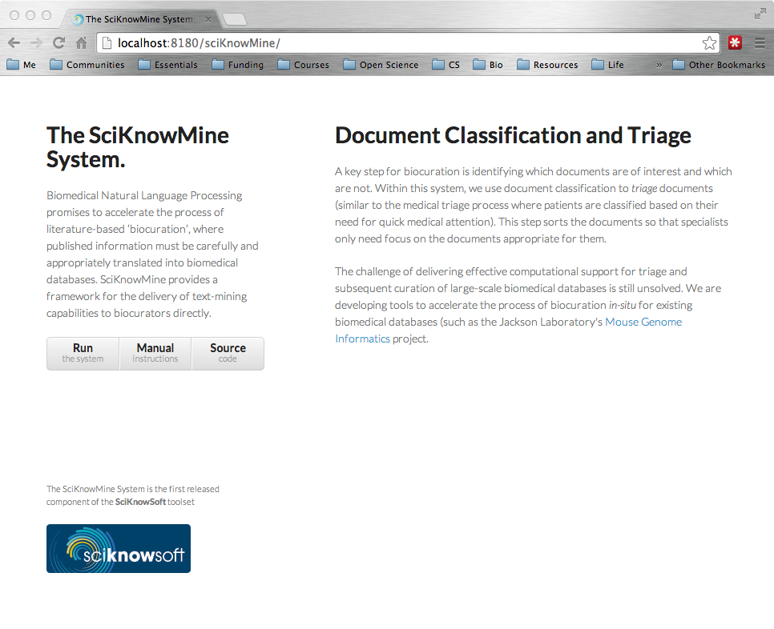

Installation Instructions
===

We recommend building and running from source. This should be straightforward and is the most functional in terms of troubleshooting and bug-fixing. User manuals can be found at http://bmkeg.github.io/sciKnowMine.

1. Clone the `bmkeg-parent` project from github to set all the dependency versions and repositories: 
	* `mvn clone https://github.com/BMKEG/bmkeg-parent`  
2. Clone the `sciKnowMine` project. This is just the wrapper for the web application. 
	* `mvn clone https://github.com/BMKEG/sciKnowMine`
	* _If you want to build all server + client elements from scratch, see our [sciKnowMineProject](https://github.com/BMKEG/sciKnowMineProject) Github page_.  
3. `cd sciKnowMine` - change directories into the project folder.
4. `mvn clean package` - build the project
5. If you would like to run the system immediately, use `mvn jetty:run-war` to run the project from the built war-file. We recommend deploying `target/sciKnowMine.war` file to a JavaEE web application server (Tomcat) to run the system in a production environment. 
6. Point your browser to `http://localhost:8080/sciKnowMine` to see the following screenshot. 

